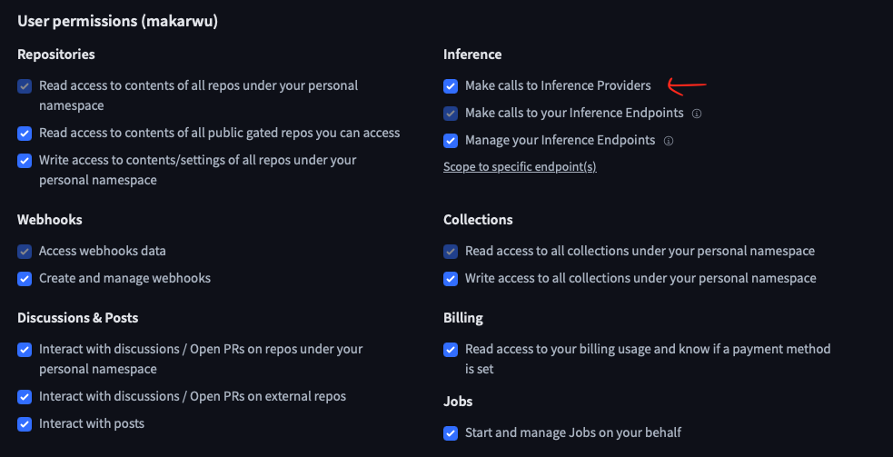
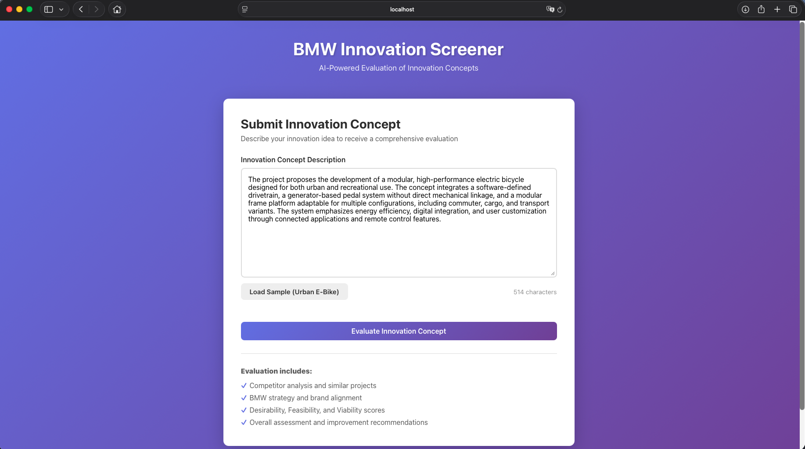

# AI-based Innovation Screener

An AI-based prototype for evaluating innovation concepts along the dimensions of **Desirability**, **Feasibility**, and **Viability**. This system provides structured feedback on innovation ideas, including competitor analysis, BMW strategy alignment, and actionable improvement recommendations.

## Overview

This full-stack application allows users to submit innovation concepts and receive comprehensive AI-generated evaluations. The system analyzes ideas across multiple dimensions:

- **Competitors & Similar Projects**: Identifies existing solutions and differentiation opportunities
- **BMW Strategy Alignment**: Evaluates fit with BMW's brand, strategy, and corporate values
- **Desirability**: Assesses market need, customer appeal, and user value
- **Feasibility**: Evaluates technical complexity, resource requirements, and regulatory challenges
- **Viability**: Analyzes market potential, cost structure, and competitive positioning
- **Overall Evaluation**: Provides summary assessment with strengths, weaknesses, and risks
- **Improvement Recommendations**: Suggests specific, actionable improvements

## Architecture

### Frontend (React + Vite)
- **Location**: `client/`
- **Technology**: React 18 with Vite 
- **Components**:
  - `EvaluationForm`: Input form for innovation concepts
  - `EvaluationResults`: Structured display of evaluation results
- **Styling**: Modern CSS with gradient design and responsive layout

### Backend (Node.js + Express)
- **Location**: `server/`
- **Technology**: Express.js REST API
- **Key Features**:
  - RESTful API endpoint for evaluation requests
  - Integration with Hugging Face for AI-powered analysis
  - Structured JSON response format

### AI Integration
- **Provider**: Hugging Face Router API
- **Model**: Configurable via `HUGGINGFACE_MODEL` environment variable
- **Default Model**: `meta-llama/Llama-3.1-8B-Instruct`
- **Prompt Engineering**: Structured prompts to ensure consistent, comprehensive evaluations
- **Response Format**: JSON-structured output for easy parsing and display

## Setup Instructions

### Prerequisites
- Node.js (v16 or higher)
- npm  
- Git (for cloning the repository)
- Hugging Face API token ([Get one here](https://huggingface.co/settings/tokens))

### Installation

1. **Clone the repository**
   
   Using HTTPS:
   ```bash
   git clone https://github.com/makarwu/urban-e-bike.git
   cd urban-e-bike
   ```
   
   Or using SSH:
   ```bash
   git clone git@github.com:makarwu/urban-e-bike.git
   cd urban-e-bike
   ```

2. **Install all dependencies**
   Make sure to be within the urban-e-bike folder. Check it with the "pwd" command.

   ```bash
   npm run install-all
   ```
   
   Or install manually:

   ```bash
   npm install
   cd server && npm install && cd ..
   cd client && npm install && cd ..
   ```

3. **Configure environment variables**
   
   Create a `server/.env` file and add your Hugging Face API key.
   This is how it looked for me:
   ```
   HUGGINGFACE_API_KEY=your_huggingface_api_key_here
   HUGGINGFACE_MODEL=meta-llama/Llama-3.1-8B-Instruct
   PORT=3001
   ```
   
   **Note**: 
   - Get Hugging Face API key: https://huggingface.co/settings/tokens
   - Make sure your token has "Make calls to Inference Providers" permission
   
   
   
   - `HUGGINGFACE_MODEL` is optional (default: `meta-llama/Llama-3.1-8B-Instruct`)
   - Hugging Face models are free to use (with rate limits)

   **Important**: Make sure there are no spaces around the `=` sign and no quotes around the values:
   ```
   Correct: HUGGINGFACE_API_KEY=sk-abc123...
   Wrong:   HUGGINGFACE_API_KEY = "sk-abc123..."
   Wrong:   HUGGINGFACE_API_KEY='sk-abc123...'
   ```

### Running the Application

**Option 1: Run both frontend and backend together**
```bash
npm run dev
```

**Option 2: Run separately**

Terminal 1 (Backend):
```bash
npm run server
```

Terminal 2 (Frontend):
```bash
npm run client
```

The application will be available at:
- **Frontend**: http://localhost:3000
- **Backend API**: http://localhost:3001

## Usage

1. **Open the application** in your browser at `http://localhost:3000`

2. **Enter an innovation concept**:
   - Type or paste your innovation idea description
   - Or click "Load Sample (Urban E-Bike)" to see an example

3. **Click "Evaluate Innovation Concept"** to submit

4. **Review the results**:
   - Overall score and recommendation
   - Desirability, Feasibility, and Viability scores
   - Detailed analysis sections
   - Improvement recommendations

5. **Evaluate another idea** by clicking "Evaluate Another Idea"

## Demo

### Application Walkthrough

Here is an image and a GIF, demonstrating the application.

#### 1. Submitting an Innovation Concept



*User enters an innovation concept and submits it for evaluation*

#### 2. Viewing Evaluation Results

*Comprehensive evaluation results showing scores, analysis, and recommendations*

#### 3. Complete User Flow


*End-to-end demonstration from concept submission to results review*

## Project Structure

```
Urban E-Bike/
├── client/                # React frontend
│   ├── src/
│   │   ├── components/    # React components
│   │   ├── App.jsx        # Main app component
│   │   └── main.jsx       # Entry point
│   ├── package.json
│   └── vite.config.js
├── docs/                  # image and GIF folder
├── server/                # Express backend
│   ├── index.js           # Express server
│   ├── evaluator.js       # Hugging Face evaluation logic
│   ├── package.json
│   └── .env               # Environment variables (create from template)
├── package.json           # Root package.json
└── README.md
```

## API Endpoints

### `POST /api/evaluate`
Evaluates an innovation concept.

**Request Body:**
```json
{
  "ideaDescription": "Your innovation concept description..."
}
```

**Response:**
```json
{
  "competitors": { ... },
  "bmwAlignment": { ... },
  "desirability": { ... },
  "feasibility": { ... },
  "viability": { ... },
  "overallEvaluation": { ... },
  "improvements": [ ... ]
}
```

## Technical Decisions

1. **React + Vite**: Fast development and modern tooling
2. **Express.js**: Flexible backend framework
3. **Llama Model**: Lightweight (low-resource) LLM for evaluation
4. **JSON Response Format**: Structured output for reliable parsing
5. **Modular Component Architecture**: Easy to extend and maintain


